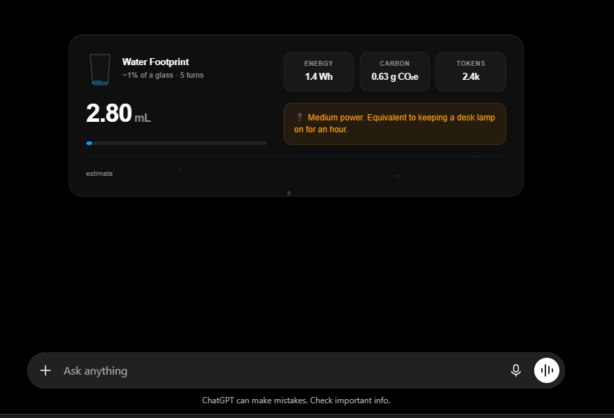

# waterusedbyourAi

waterusedbyourAi is an open-source footprint tracker that calculates the water, energy, and carbon footprint behind your AI conversations. It runs entirely locally in your browser to maintain total privacy.



## Overview

Large language models require high-density compute clusters. These clusters consume electricity and require substantial cooling (direct evaporation or thermoelectric heat exchange). waterusedbyourAi models this footprint dynamically:
1. It parses the conversation history on AI chat interfaces to compute token counts.
2. It translates tokens into energy usage (Watt-hours) based on target model profiles.
3. It estimates the water (milliliters) and carbon (milligrams of CO2 equivalent) footprint using regional grid power mixes and average cooling overheads.
4. It displays these metrics inline in a clean widget below the assistant's reply.

## Features

- Multi-Site Compatibility: Runs seamlessly on ChatGPT, Claude, Google Gemini, and Perplexity.
- Apple Widget Design: A side-by-side widget utilizing glassmorphism styling, clean San Francisco typography, and iOS system color-coding.
- 60fps Physics & Inertia: Animated water glass SVG filling level and bubbles, along with smooth exponential counter increments.
- Accessible Banners: Status notifications that summarize chat footprint intensity.
- Complete Privacy: Runs 100% locally in the browser with zero external network requests.

## Project Architecture

The project is structured as a monorepo using npm workspaces:

- packages/core: The shared footprint estimation engine. It handles token-to-energy calculations, grid mixes, and provider profiles.
- surfaces/browser-extension: Manifest V3 content script and styles that inject the widget inline on AI chat domains.
- surfaces/cli: A CLI integration script for terminal toolkits (such as Claude Code) to output session footprints.
- surfaces/api-wrapper: A node helper to analyze LLM API response usage payloads programmatically.
- plugins/: Pluggable providers (such as plugins/provider-xai) that register model coefficients dynamically without touching the core engine.

## Installation

To load the extension in your browser:

1. Clone the repository and install the development dependencies:
   ```bash
   npm install
   ```

2. Build the browser extension surface:
   ```bash
   npm run build:ext
   ```

3. Open your browser and navigate to the Extensions page:
   - For Google Chrome: chrome://extensions
   - For Microsoft Edge: edge://extensions

4. Enable Developer Mode (usually a toggle in the top-right corner).

5. Click "Load unpacked" and select the following subdirectory from this project folder:
   ```
   surfaces/browser-extension
   ```

6. Navigate to ChatGPT, Claude, Gemini, or Perplexity and start a conversation. The widget will display under the completed replies.

## Development and Verification

Run the test suite across all workspaces:
```bash
npm test
```

Perform typescript compilation validation:
```bash
npm run typecheck
```

## License

MIT License. See the LICENSE file for details.
